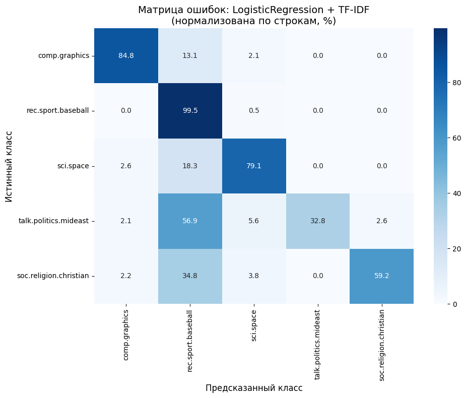

# Кластеризация и многоклассовая классификация на датасете 20Newsgroups

## Задача
Сравнить методы векторизации текстов и классификаторы для многоклассовой классификации новостных текстов. Определить, какая комбинация «векторизация + классификатор» даёт наилучшее качество, и исследовать структуру данных с помощью кластеризации.

## Данные
Коллекция 20 Newsgroups — 20 000 новостных текстов, распределённых по 20 категориям. Для анализа выбраны 5 классов (comp.graphics, rec.sport.baseball, sci.space, talk.politics.mideast, soc.religion.christian).

## Проведённые эксперименты
- **EDA:** анализ распределения классов, длины текстов, визуализация выбросов (boxplot)
- **Предобработка:** приведение к нижнему регистру, удаление пунктуации и стоп-слов, лемматизация
- **Векторизация:** сравнение трёх методов (Bag of Words, TF‑IDF, Word2Vec)
- **Кластеризация:** KMeans (k=5), оценка ARI/NMI, анализ соответствия кластеров классам, бинарная кластеризация (space vs religion)
- **Классификация:** 4 модели (LR, SVM, RF, XGBoost) + GridSearchCV
- **Анализ ошибок:** матрица ошибок, топ-10 самых уверенных ошибок модели
- **Дисбаланс классов:** эксперименты с взвешиванием классов и oversampling
- **Ансамбль:** VotingClassifier (LR + SVM + XGB)

### Результаты
| Векторизация | Классификатор | F1-macro |
|--------------|---------------|----------|
| BoW | LogisticRegression | 0.8779 |
| BoW | SVM | 0.8454 |
| **TF-IDF** | **LogisticRegression** | **0.9072** |
| TF-IDF | SVM | 0.9030 |
| Word2Vec | SVM | 0.8419 |

**Лучшая комбинация:** LogisticRegression + TF-IDF (F1-macro = 0.9072)

- **Бинарная классификация space/religion:** F1 = 0.96
- **Кластеризация:** KMeans, ARI = 0.26
- **Матрица ошибок классификации:**

## Основные выводы

1. **Кластеризация** выявила неоднородность класса religion: около 35% религиозных текстов имеют общую дискуссионную лексику, что привело к их смешению с sci.space в общем кластере.
2. **Бинарная классификация** space vs religion достигла F1 = 0.96, подтвердив, что классы различны, а проблема — в неоднородности religion.
3. **Дисбаланс** классов ухудшает качество; взвешивание классов и oversampling эффективно восстанавливают метрики (F1 = 0.921).
4. **Ансамбль** (LR + SVM + XGB) дал микроулучшение (F1 = 0.909 vs 0.907) — модели уже близки к оптимуму.

## Файлы

- `project.ipynb` – основной ноутбук
- `requirements.txt` – зависимости

## Автор
Филиппова Евгения
